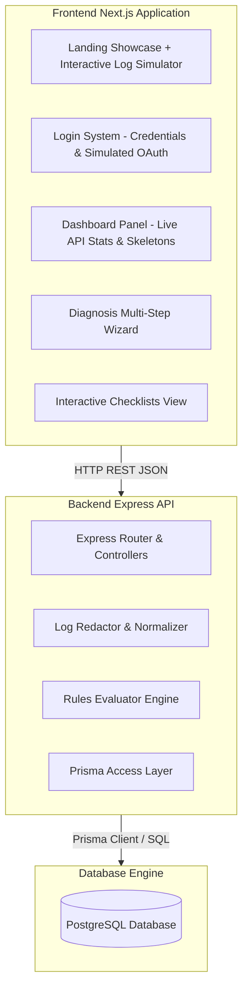
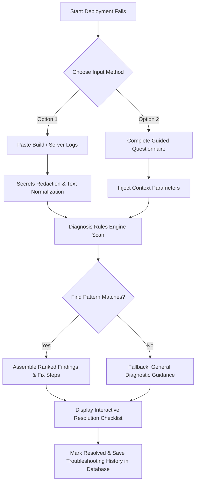
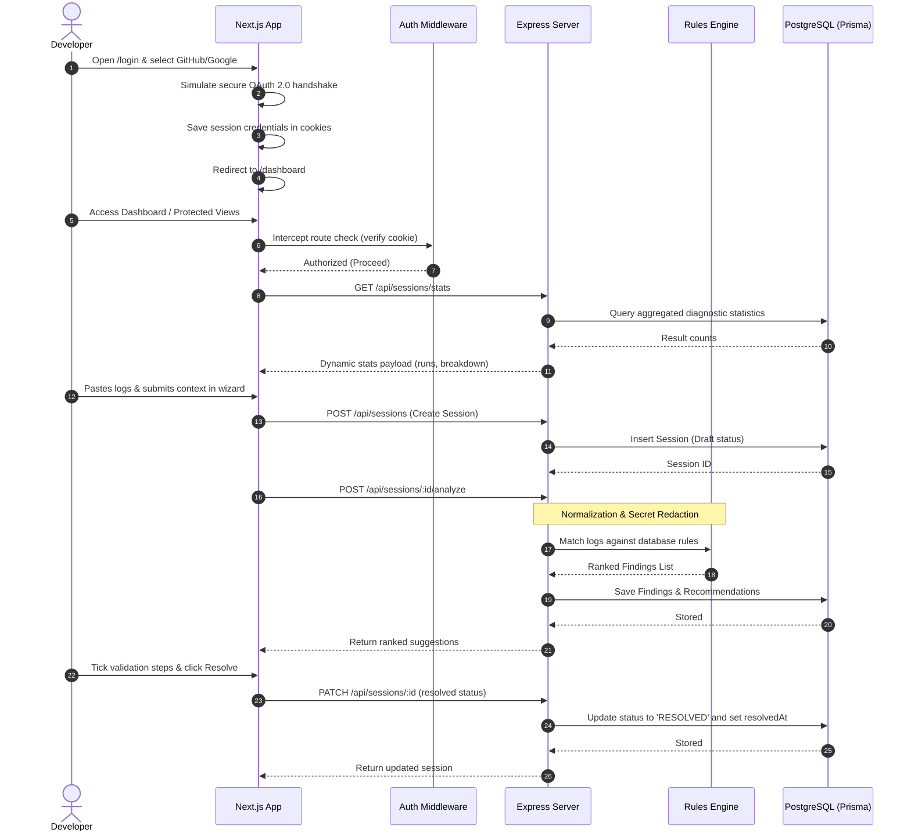

# 🚀 LaunchLens - DeployFix Assistant

Welcome to **LaunchLens**! 👋

Are you a beginner who just got a scary wall of red text when trying to deploy your app on Vercel, Netlify, or Railway? Don't worry! **LaunchLens** is a developer-focused diagnostic tool that decodes those failed deployment logs into plain-English explanations. It tells you exactly what went wrong and gives you an easy, step-by-step checklist to fix it.

---

## ✨ Features

- **Log Decoder:** Paste your confusing build/server logs, and we'll translate them into human-readable issues.
- **Guided Fixes:** Get a step-by-step interactive checklist to resolve your deployment errors.
- **Secrets Redaction:** Your sensitive data (like API keys) are automatically hidden for safety.
- **Dashboard & Stats:** Keep track of your past debugging sessions and see your success rates.
- **Easy Authentication:** Secure login using simulated OAuth.

---

## 🎥 Interactive Demo

*(Here are some quick previews of LaunchLens in action!)*

### 1. Analyzing Logs

> *Watch how LaunchLens instantly parses a Vercel build failure.*

### 2. Step-by-Step Fixes

> *Follow the simple checklist to solve the root cause.*

*(Note: If the GIFs are not loading, they will be uploaded soon!)*

---

## 🛠️ How It Works (System Architecture)

Here is a simplified view of how the Next.js frontend talks to our Express backend.



---

## 🔍 Troubleshooting Workflow

Wondering what happens when you paste your logs? Here is the flow!



---

## ⚙️ Sequence Flow Diagram

For the advanced users, here is the sequence of network requests during a debugging session:



---

## 🚀 Getting Started

Follow these instructions to run the project on your local machine. It's beginner-friendly!

### Prerequisites
Before you start, make sure you have:
- **Node.js (v18+)**: [Download here](https://nodejs.org/)
- **PostgreSQL**: Install it locally or run a Docker container.
- **npm**: Comes with Node.js.

### 1️⃣ Database Setup
First, we need to set up the database to store our rules and logs.

1. Navigate to the backend folder:
   ```bash
   cd backend
   ```
2. Create a `.env` file in the `backend/` directory and configure your PostgreSQL connection URL:
   ```env
   DATABASE_URL="postgresql://<USER>:<PASSWORD>@localhost:5432/deployfix?schema=public"
   PORT=5000
   ```
3. Push the schema to your database (creates the tables):
   ```bash
   npx prisma db push
   ```
4. Populate the database with diagnostic rules (seeding):
   ```bash
   npx prisma db seed
   ```

### 2️⃣ Backend Setup
Now let's start the API server!

1. Still inside the `backend` folder, install the required packages:
   ```bash
   npm install
   ```
2. Start the backend development server:
   ```bash
   npm run dev
   ```
   *The backend will now be running on [http://localhost:5000/api](http://localhost:5000/api).*

### 3️⃣ Frontend Setup
Finally, let's start the user interface!

1. Open a **new terminal** and navigate to the frontend folder:
   ```bash
   cd frontend
   ```
2. Install the required packages:
   ```bash
   npm install
   ```
3. Start the frontend development server:
   ```bash
   npm run dev
   ```
4. Open your browser and go to [http://localhost:3000](http://localhost:3000). 
5. You'll be redirected to `/login`. Sign in using email credentials or simulate OAuth, and start analyzing logs!

---

## 💡 How to Use
1. **Login:** Once the app is running, sign in.
2. **Dashboard:** You'll see your dashboard with past sessions. Click "New Diagnosis" (or equivalent) to start.
3. **Paste Logs:** Copy your failed deployment logs from Vercel/Netlify and paste them into the wizard.
4. **Get Fixes:** LaunchLens will decode the logs and give you a checklist.
5. **Resolve:** Follow the checklist, fix your code, and mark the issue as resolved!

---

## 🤝 Contributing
Contributions are always welcome! Feel free to open an issue or submit a pull request if you want to add new rules or features.

## 📄 License
This project is open-source and available under the MIT License.
