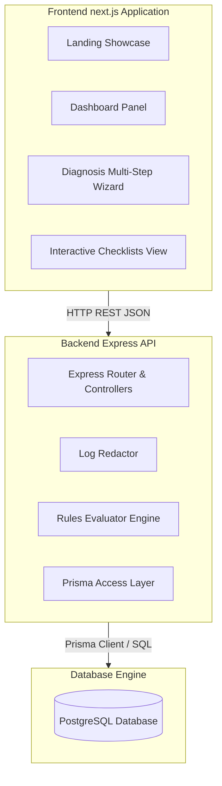
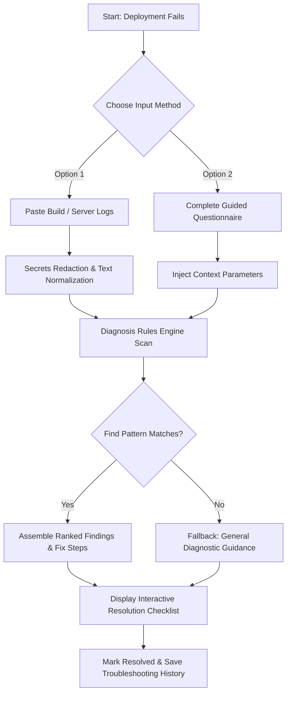
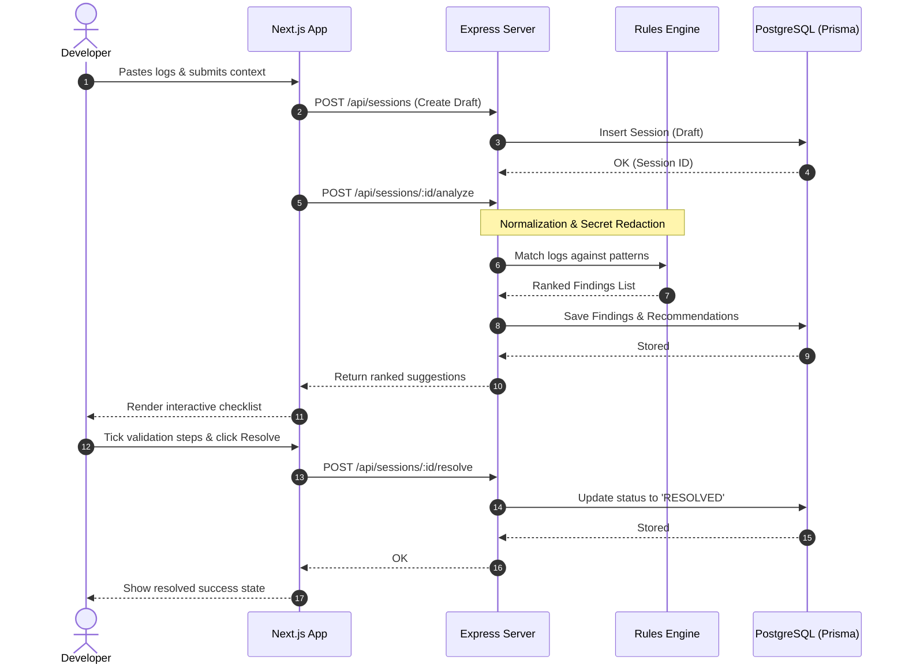

# LaunchLens - DeployFix Assistant

LaunchLens is a developer-focused diagnostic tool that decodes failed deployment logs and environment variables from modern platforms like Vercel, Netlify, and Railway into plain-English root causes and validation checklists.

---

## 1. System Architecture (Normal Graph)

This graph displays the split client-server organization, where the Next.js frontend communicates with the Express backend via REST API calls, and the backend persists records using the Prisma client.



---

## 2. Troubleshooting Workflow (Workflow Graph)

This graph displays the steps taken to process a deployment logs diagnostic session, from inputs to final resolution.



---

## 3. Sequence Flow Diagram (Sequence/Animated Graph)

This diagram details the sequence of network requests, rules validation, and database updates executed during a typical debugging session.



---

## 4. Getting Started

### Frontend Setup
1. Open a new terminal and navigate to the frontend folder:
   ```bash
   cd frontend
   ```
2. Install dependencies and start the development server:
   ```bash
   npm install
   npm run dev
   ```
3. Open [http://localhost:3000](http://localhost:3000) to view the application.

### Backend Setup
1. Open a new terminal and navigate to the backend folder:
   ```bash
   cd backend
   ```
2. Install dependencies:
   ```bash
   npm install
   ```
3. Copy environment configurations and generate the database clients:
   ```bash
   # Ensure env variables are configured in .env
   npm run prisma:generate
   ```
4. Start the development server:
   ```bash
   npm run dev
   ```
   The backend API will run on [http://localhost:5000/api](http://localhost:5000/api).
